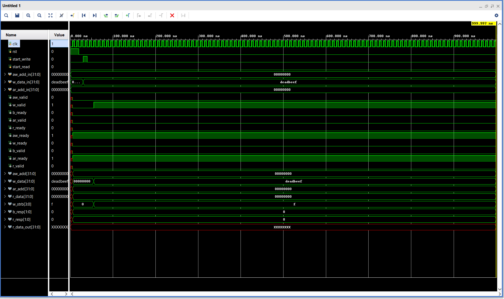

AXI4-Lite Master-Slave Interface

A complete implementation of the AXI4-Lite protocol interface in Verilog, featuring independent master and slave modules with concurrent read/write capabilities.

Project Overview

This project implements the ARM AMBA AXI4-Lite protocol, a simplified subset of the AXI4 protocol designed for simple, low-throughput memory-mapped communication.

Features
- Fully compliant AXI4-Lite handshake protocol
- Independent read and write state machines
- 4 × 32-bit register bank with byte-addressable memory
- Concurrent read/write operation support
- Comprehensive testbench with multiple test scenarios
- Synthesis-verified design (Xilinx Artix-7 FPGA)

Architecture

Master Module (`axi4_lite_master.v`)
- 6-state FSM (IDLE → AW → W → B → AR → R)
- Initiates read/write transactions
- Handles response checking

Slave Module (`axi4_lite_slave.v`)
- Dual FSM architecture (write: 3 states, read: 2 states)
- 4 × 32-bit internal register array
- Address decoding using bits [3:2]

Top Wrapper (`axi4_lite_top.v`)
- Instantiates and connects master and slave
- Synthesis-ready top-level module

Resource Utilization

Synthesized for Xilinx Artix-7 (xc7a35tcpg236-1):

| Resource        | Used | Available | Utilization |
|-----------------|------|-----------|-------------|
| Flip-Flops      | 254  | 41,600    | 0.61%       |
| LUTs            | 59   | 20,800    | 0.28%       |
| Latches         | 0    | -         | 0%          |

0 Latches - Clean RTL design with no combinational loops

Getting Started

Prerequisites
- ModelSim / Vivado Simulator / Icarus Verilog
- Xilinx Vivado (for synthesis)

Running Simulation
```bash
# Using Icarus Verilog
iverilog -o sim rtl/axi4_lite_master.v rtl/axi4_lite_slave.v testbench/tb_axi4_lite.v
vvp sim

# View waveforms
gtkwave axi4_lite.vcd
```

Synthesis

1. Open Vivado and create new project
2. Add all files from `rtl/` directory
3. Set `axi4_lite_top.v` as top module
4. Run Synthesis → Implementation → Generate Bitstream

Project Structure
```
AXI4-Lite-Interface/
├── rtl/                    # RTL source files
│   ├── axi4_lite_master.v
│   ├── axi4_lite_slave.v
│   └── axi4_lite_top.v
├── testbench/              # Verification files
│   └── tb_axi4_lite.v
├── docs/                   # Documentation & screenshots
│   ├── waveform.png
│   └── utilization_report.txt
└── README.md
```

Verification

The testbench performs the following tests:
1. Write to address 0x00, read back and verify
2. Write to address 0x04, read back and verify
3. Verify data persistence across addresses
4. Write to all 4 registers
5. Read back all registers and verify

Result: All tests passed

Simulation Results



Waveform showing successful read/write transactions with proper handshaking

Technologies Used

- HDL: Verilog
- Simulation: ModelSim / Icarus Verilog
- Synthesis: Xilinx Vivado 2025.2
- Target Device: Xilinx Artix-7 FPGA

Key Concepts Demonstrated

- AXI4-Lite protocol implementation
- FSM design for protocol handling
- Handshake-based communication
- Memory-mapped register access
- Concurrent read/write operations
- Address decoding
- Synthesizable RTL coding practices

License

This project is licensed under the MIT License - see the LICENSE file for details.

Author

Akshith Kumar Sambugari
- Email: sambugariakshith@gmail.com
- LinkedIn: www.linkedin.com/in/akshithkumar


Acknowledgments

- ARM AMBA AXI4-Lite Protocol Specification
- Xilinx AXI Reference Guide
```

---

Step 5: Create .gitignore File

Create a file named `.gitignore` with this content:
```
# Simulation files
*.vcd
*.wdb
*.jou
*.log
*.pb
*.wlf
transcript
work/
sim/
*.vvp

# Vivado files
*.jou
*.log
*.backup.*
*.debug
*.rpt
*.dcp
*.bit
*.ltx
*.cache/
*.hw/
*.ip_user_files/
*.runs/
*.sim/
*.xpr
.Xil/

# OS files
.DS_Store
Thumbs.db
*~